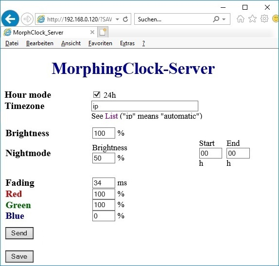

# HariFun\_166\_Morphing\_Clock modified by SnowHead

----------

# Attention! At the moment this fork only works for ESP8266 !
## The search and inlucde of the suitable libraries for ESP32 is in progress 
----------

Read what this code primary was all about on [Instructable](https://www.instructables.com/id/Morphing-Digital-Clock/).

**CHANGES BY SNOWHEAD**

- Changed from NTP to HTTP time request (via ESP82666HTTPClient library)
- No further mess around with timezones and DST settings. The default timezone "ip" (case sensitive!) will force the server to determine your location and DST state by analyzing your public IP. Only if you're connected via a foreign proxy to the internet you will have to set your local timezone regarding the list on [WTA](http://worldtimeapi.org/api/timezones). DST settings will always be detected automatically.
- Digits will not further morphed digit by digit but all in parallel.
- Easier selection of digit color.
- Patch for weak ESP8266-12E included
- Night-Mode (ESP32 only), of "Start" or "End" hour are different from zero, the displays brighness will be reduced between this both times to the percentage set in "Brightness"
- permanent accessible Web-Interface for live change of the settings (military, timezone, color, fadingspeed and (ESP32 only) nightmode and brightness), settings take only effect after clicking button "Send", clicking the button "Save" stores the changes permanent in the clock

Click photo for a quick demo.

original: 

modified: 

Because the ESP8266 is not able to dimm the brightness by PWM (trying this will produce an ugly flicker) the webinterface differs for ESP32 and ESP8266. The ESP8266 has no nightmode, cann not reduce the brightness and must use all colors in full brightness.

   ESP32:&nbsp;&nbsp;&nbsp;&nbsp; 

ESP8266:

